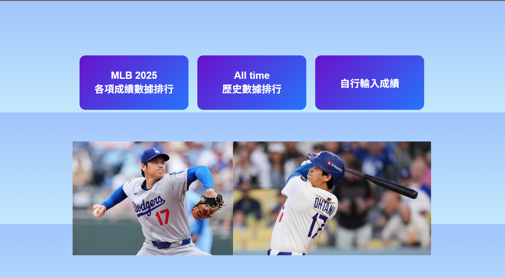

# Baseball Boot

棒球隊成績管理系統

Baseball Boot 是一個使用 **Java 21 / Spring Boot** 開發的棒球成績管理網站，提供球隊註冊登入、球員成績 CRUD 管理、JWT 身分驗證與資料權限控制，並整合 MLB 球員排行榜資料。

專案已部署至 Render，並使用 Neon PostgreSQL 雲端資料庫。

---

## 線上網站

https://baseball-boot.onrender.com/html/index.html

> Render 使用免費方案，閒置後服務可能進入休眠，因此首次開啟網站時請稍等30~60秒。

## 專案畫面

### 首頁



---

## 專案特色

* 使用 Spring Boot 建立 RESTful API
* 使用 Spring Security + JWT 實作身分驗證
* 使用 BCrypt 加密使用者密碼
* 使用 Jakarta Validation 驗證使用者輸入資料
* 使用 Global Exception Handler 統一處理 API 錯誤
* 使用 Swagger/OpenAPI 建立 API 文件與測試介面
* 使用 SLF4J Logger 記錄系統執行資訊
* 限制各球隊只能管理自己的球員資料
* 使用 Spring Data JPA 操作資料庫
* 使用 Liquibase 管理資料庫 Schema
* 使用 Python 取得與處理 MLB 球員資料
* 使用 JUnit 5 + Mockito 撰寫單元測試
* 部署至 Render + Neon PostgreSQL

---

## 核心功能

### 使用者管理

* 球隊註冊
* 球隊登入
* JWT Token 驗證
* BCrypt 進行密碼雜湊


### 球員成績管理

* 投手 CRUD
* 打者 CRUD


### MLB 排行榜

* 2025年度紀錄排行榜
* 生涯紀錄排行榜


### 資料權限控制

依照 JWT Token 中的球隊資訊識別使用者，限制各球隊只能管理自己的球員資料。


### 資料驗證

使用 Jakarta Validation 驗證 API 輸入內容，避免不合法資料寫入資料庫。


### API 文件

使用 Swagger / OpenAPI 提供 API 文件，方便測試與驗證各項 REST API。


---

## 技術亮點

* RESTful API 設計
* JWT Authentication & Authorization
* Role-Based Access Control
* Bean Validation
* Global Exception Handling
* Database Migration（Liquibase）
* Cloud Deployment（Render + Neon PostgreSQL）
* Python 擷取 MLB Stats API

---


## 使用技術

### Backend

* Java 21
* Spring Boot
* Spring Security
* Spring Data JPA
* JWT
* BCrypt
* Jakarta Validation
* Global Exception Handler (@ControllerAdvice)
* SLF4J Logger
* Swagger / OpenAPI
* Liquibase
* Maven


### Database

* PostgreSQL
* Neon PostgreSQL
* MariaDB


### Frontend

* HTML
* CSS
* JavaScript
* Fetch API


### Testing

* JUnit 5
* Mockito
* Swagger UI
* Postman


### Other

* Python
* MLB Stats API
* Git
* GitHub
* Eclipse
* Render

---

## 單元測試

本專案使用 JUnit 5 與 Mockito 撰寫 Service Layer 單元測試。

目前已涵蓋：

* ClubServiceImpl
* BatterStatsServiceImpl

---

## 系統架構

```text
Browser
   │
   ▼
HTML / CSS / JavaScript
   │
   ▼
Spring Boot REST API
   │
   ├── Spring Security + JWT
   ├── Service Layer
   └── Spring Data JPA
   └── Swagger / OpenAPI
            │
            ▼
    Neon PostgreSQL
```

---

## 雲端部署

```text
Eclipse
   │
   │ Commit / Push
   ▼
GitHub
   │
   │ Auto Deploy
   ▼
Render
   │
   │ Database Connection
   ▼
Neon PostgreSQL
```

程式碼 Push 至 GitHub 後，由 Render 自動重新建置與部署，並連線至 Neon PostgreSQL 雲端資料庫。

---

## 未來規劃

* 增加分頁與排序功能
* 優化使用者介面
* 增加球員數據分析功能
* 自動排程更新 MLB 球員資料


---

## 作者

GitHub：

https://github.com/ohtatin
